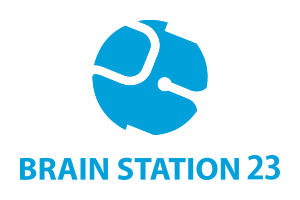

= Cox's Bazar Tour Initiatory: HealthTech SBU
Team AbbVie
2022-06-18 to 2022-06-20
:description:
:organization: Brain Station 23 Ltd
:doctype: book
:preface-title: Preface
// Settings:
:experimental:
:reproducible:
:icons: font
:listing-caption: Listing
:sectnums:
:toc:
:toclevels: 3
:xrefstyle: short
:linkattrs:
ifdef::backend-pdf[]
:pdf-theme: chronicles
:pdf-themesdir: {docdir}
:title-logo-image: 
:source-highlighter: rouge
//:rouge-style: github
endif::[]
// URIs:
:uri-devoxx: https://devoxx.be
:uri-devoxx-top-talks: https://www.youtube.com/watch?v=1OpAgZvYXLQ&list=PLRsbF2sD7JVq7fv1GZGORShSUIae1ZAPy&index=1
:uri-stbernardusabt12: http://www.sintbernardus.be/stbernardusabt12.php?l=en
:uri-wolpertinger: http://en.wikipedia.org/wiki/Wolpertinger

[%notitle]
--

[quote,Julius Caesar]
Veni, vidi, vici
--

== Tour Initiatory

=== Day 1 - Saturday

.Saturday - 2022-06-18
[width="100%",cols="^.^1,^.^2m,<.^5,6,^.^3",frame="topbot",options="header"]
|==========================
|No.      |Time |Details  |Place |Participants
|01 |07:00 AM|Reporting at Airport |https://www.google.com/maps/dir/23.7746591,90.4030952/Dhaka+Airport+Domestic+Terminal/@23.8120394,90.3742392,13z/data=!3m1!4b1!4m9!4m8!1m1!4e1!1m5!1m1!1s0x3755c7e636591619:0xe6251dae93126c85!2m2!1d90.4063282!2d23.846541[Hazrat Shahjalal International Airport (Domestic Terminal)]|All
|02 |07:15 AM|Team Photo Session |https://www.google.com/maps/dir/23.7746591,90.4030952/Dhaka+Airport+Domestic+Terminal/@23.8120394,90.3742392,13z/data=!3m1!4b1!4m9!4m8!1m1!4e1!1m5!1m1!1s0x3755c7e636591619:0xe6251dae93126c85!2m2!1d90.4063282!2d23.846541[Hazrat Shahjalal International Airport (Domestic Terminal)]|All
|03 |07:45 AM|Plane On-Boarding|https://www.google.com/maps/dir/23.7746591,90.4030952/Dhaka+Airport+Domestic+Terminal/@23.8120394,90.3742392,13z/data=!3m1!4b1!4m9!4m8!1m1!4e1!1m5!1m1!1s0x3755c7e636591619:0xe6251dae93126c85!2m2!1d90.4063282!2d23.846541[Hazrat Shahjalal International Airport (Domestic Terminal)]|All
|04 |09:45 AM|Airport Pickup |https://www.google.com/maps/dir/23.7746591,90.4030952/cox%E2%80%99s+bazar+airport/@22.5924855,90.132856,8z/data=!3m1!4b1!4m9!4m8!1m1!4e1!1m5!1m1!1s0x30adc83c926f59f1:0xb13b426bade6ac8b!2m2!1d91.9666701!2d21.4506677[Cox's Bazar Airport]|All
|05 |02:00 PM|Hotel Check-in |https://www.google.com/maps/dir/23.7746591,90.4030952/ocean+paradise/@22.5917087,90.132856,8z/data=!3m1!4b1!4m9!4m8!1m1!4e1!1m5!1m1!1s0x30adc62a55555555:0x2e775757ca43f46a!2m2!1d91.9824464!2d21.4184603[Ocean Paradise Hotel & Resort]|All
|06 |04:00 PM|Football Match |Sea Beach|All Male
|07 |04:00 PM|Throw the ball |Sea Beach|All Female
|08 |05:00 PM|Sand Castle |Sea Beach|All Children
|09 |07:00 PM|Buffet Dinner|https://www.google.com/maps/dir/23.7746591,90.4030952/long+beach+hotel+cox%E2%80%99s+bazar/@22.5924855,90.132856,8z/data=!3m1!4b1!4m9!4m8!1m1!4e1!1m5!1m1!1s0x30adc8652d5a8305:0xad38092104307ea7!2m2!1d91.9787368!2d21.4258575[Long Beach Hotel Cox's Bazar]|All
|==========================

.Reporting at Airport
[CAUTION]
====
You must bring your #((NID / Passport))# . We recommend, you should also bring a copy of your ticket along with you.
====

.Reporting at Airport
[WARNING]
====
#((Photo session and Plane on-boarding))# scheduled time will be maintained strictly.
Please plan accordingly.
====

<<<

=== Day 2 - Sunday

.Sunday - 2022-06-19
[width="100%",cols="^.^1,^.^2m,<.^5,6,^.^3",frame="topbot",options="header"]
|==========================
|No.      |Time |Details  |Place |Participants
|01 |07:00 AM - 10:00 AM|Buffet Breakfast |https://www.google.com/maps/dir/23.7746591,90.4030952/ocean+paradise/@22.5924855,90.132856,8z/data=!3m1!4b1!4m9!4m8!1m1!4e1!1m5!1m1!1s0x30adc62a55555555:0x2e775757ca43f46a!2m2!1d91.9824464!2d21.4184603[Ocean Paradise Hotel & Resort]|All
|02 |07:00 PM|Buffet Dinner (BBQ) |https://www.google.com/maps/dir/23.7746591,90.4030952/seagull+hotel+cox%E2%80%99s+bazar/@22.5924855,90.132856,8z/data=!3m1!4b1!4m9!4m8!1m1!4e1!1m5!1m1!1s0x30adc865db404999:0xf44aaf15913e1862!2m2!1d91.9759746!2d21.4250912[Seagull Hotel]|All
|==========================

[TIP]
====
. Breakfast time is flexible.
Choose your convenient time accordingly.
. Try to join Buffet Dinner on time.
====

=== Day 3 - Monday

.Monday - 2022-06-20
[width="100%",cols="^.^1,^.^2m,<.^5,6,^.^3",frame="topbot",options="header"]
|==========================
|No.      |Time |Details  |Place |Participants
|01 |07:00 AM - 08:30 AM|Buffet Breakfast |https://www.google.com/maps/dir/23.7746591,90.4030952/ocean+paradise/@22.5924855,90.132856,8z/data=!3m1!4b1!4m9!4m8!1m1!4e1!1m5!1m1!1s0x30adc62a55555555:0x2e775757ca43f46a!2m2!1d91.9824464!2d21.4184603[Ocean Paradise Hotel & Resort]|All
|02 |08:45 AM|Hotel Check-out |https://www.google.com/maps/dir/23.7746591,90.4030952/ocean+paradise/@22.5924855,90.132856,8z/data=!3m1!4b1!4m9!4m8!1m1!4e1!1m5!1m1!1s0x30adc62a55555555:0x2e775757ca43f46a!2m2!1d91.9824464!2d21.4184603[Ocean Paradise Hotel & Resort]|All
|03 |09:00 AM|Airport Drop |https://www.google.com/maps/dir/23.7746591,90.4030952/ocean+paradise/@22.5924855,90.132856,8z/data=!3m1!4b1!4m9!4m8!1m1!4e1!1m5!1m1!1s0x30adc62a55555555:0x2e775757ca43f46a!2m2!1d91.9824464!2d21.4184603[Ocean Paradise Hotel & Resort]|All
|04 |09:15 AM|Reporting at Airport |https://www.google.com/maps/dir/23.7746591,90.4030952/cox%E2%80%99s+bazar+airport/@22.5924855,90.132856,8z/data=!3m1!4b1!4m9!4m8!1m1!4e1!1m5!1m1!1s0x30adc83c926f59f1:0xb13b426bade6ac8b!2m2!1d91.9666701!2d21.4506677[Cox's Bazar Airport]|All
|==========================

[CAUTION]
====
. Breakfast time is flexible but shorter than previous day.
====

== Health and Safety Measures

. Please save your group POC mobile number.
In case of any support/emergency, feel free to knock your group POC.
. Enable mobile data in your mobile.
. Be aware of weather and water conditions and heed warnings
. Never swim alone, regardless of your age or level of swimming skills.
. While riding a bike wear helmet.
. In Marine drive Ride in a group.
. In solo activity please inform anyone of the group or give a text in What'sApp group.

[WARNING]
====
Each dayend we will reconcile every group member health status.
If you get any message/call from your POC, #((please consider it's very urgent and respond with priority.))#
====

== Groups

.Group Members
[width="100%",cols="^2m,^3,^1,<5",frame="topbot",options="header"]
|==========================
|Group  |POC |No.      |Members
.3+^.^| Group 1 .3+^.^| Md. Rezaul Hasan +8801678664700 |1 <|Asif Ul Huque
|2 <|Md Asadul Islam
|3 <|S M Obidul Kader Milon

4+|

.4+^.^| Group 2 .4+^.^| Tareq Mamun +8801674646008 |1 <|Sadia Afroz
|2 <|Mohibur Rahman Mohib
|3 <|Tareq Mamun
|4 <|Fateha -Tuz-Zohora

4+|

.6+^.^| Group 3 .6+^.^| Jubayer Araf +8801633022194 |1 <|Abdullah - Al - Mahedi Sabuj
|2 <|Golam Asad Pias
|3 <|Redoan Hasan Khan
|4 <|Md. Shariful Bari
|5 <|Jubayer Araf (3A)
|6 <|Md. Rezaul Hasan (3A)

4+|

.4+^.^| Group 4 .4+^.^| Mir Rayan +8801670100800 |1 <|Md. Rezwanur Rahman Khan
|2 <|Mir Rayan
|3 <|Sadia Hossain
|4 <|Badiuzzaman

4+|

.4+^.^| Group 5 .4+^.^| Noor Ismot Ara +8801777904094 |1 <|Noor Ismot Ara (5A)
|2 <|Ishadie Namir (5A)
|3 <|Nusrat Jahan Monisha (5B)
|4 <|Mahiya Hasan (5B)

4+|

.6+^.^| Group 6 .6+^.^| Md Hafizur Rahman +8801721661488 |1 <|Apurba Kumar Biswas (6A)
|2 <|Ejaz Ahmad (6A)
|3 <|Md Hafizur Rahman (6B)
|4 <|Mohibul Hasan Chowdhury (6B)
|5 <|Md. Abu Sayed (6C)
|6 <|Mehedi Hasan (6C)

|==========================

== Suggested Places to Visit

=== Route - City

.City
[width="100%",cols="^1,<3,<2,2",frame="topbot",options="header"]
|==========================
|No.      |Venue |Type  |Map Location
|01 |Radiant Fish World |Sightseeing | https://www.google.com/maps/place/Radiant+Fish+World/@21.4422804,91.9677484,17z/data=!3m1!4b1!4m5!3m4!1s0x30adc9cd2420becf:0xdba645fbeffa85f4!8m2!3d21.4422754!4d91.9699371[map,role=external,window=_blank]
|02 |Moheshkhali Island |Sightseeing | https://www.google.com/maps/place/Maheshkhali+Island/@21.6111305,91.9423563,15z/data=!3m1!4b1!4m5!3m4!1s0x30adb054f3e3a3db:0xe7aa1f69b2c49c03!8m2!3d21.6111111!4d91.9511111[map,window="_blank"]
|03 |Ramu |Sightseeing | https://www.google.com/maps/place/Ramu/@21.4325161,92.0913076,15z/data=!3m1!4b1!4m5!3m4!1s0x30adc0f3e25bfdab:0x4c9df52bca6fbc34!8m2!3d21.4323682!4d92.1008486[map,window="_blank"]
|04 |Burmese Market |Sightseeing | https://www.google.com/maps/place/Burmese+Market/@21.4267612,91.9685509,17z/data=!3m1!4b1!4m5!3m4!1s0x30adc842a1abd001:0x3863e589657fc9e9!8m2!3d21.4267563!4d91.9730356[map,window="_blank"]
|05 |Poushee |Food | https://www.google.com/maps/place/Poushee+Hotel+%26+Restaurant/@21.4423061,91.9683369,17z/data=!3m1!4b1!4m5!3m4!1s0x30adc815055f4187:0xcd4f33e0418601e7!8m2!3d21.4423012!4d91.9705257[map,window="_blank"]
|06 |Salts |Food | https://www.google.com/maps/place/Salt+Bistro+%26+Cafe/@21.4274726,91.9754211,17z/data=!3m1!4b1!4m5!3m4!1s0x30adc8655a31efcb:0x5da86c8f26b26ec3!8m2!3d21.4274676!4d91.9776098[map,window="_blank"]
|07 |Niribili Restaurant |Food | https://www.google.com/maps/place/Niribili+Restaurant/@21.4274624,91.9731441,17z/data=!3m1!4b1!4m5!3m4!1s0x30adc8655bcb9013:0x44f592770d35c5dd!8m2!3d21.4274575!4d91.9776288[map,window="_blank"]
|08 |Jaubon |Food | https://www.google.com/maps/place/Jhaubon+Restaurant/@21.4273497,91.9736812,17z/data=!3m1!4b1!4m5!3m4!1s0x30adc86553b2e2ab:0xee8d3b17322d1e9f!8m2!3d21.4273391!4d91.978154[map,window="_blank"]
|09 |KFC |Food | https://www.google.com/maps/place/KFC+(Cox's+Bazar)/@21.4267088,91.9763376,17z/data=!3m1!4b1!4m5!3m4!1s0x30adc8655236c67d:0x571944f5a831ea52!8m2!3d21.4267038!4d91.9785263[map,window="_blank"]
|10 |Mermaid Cafe (Shougondha Beach) |Food | https://www.google.com/maps/place/Mermaid+Cafe/@21.4212621,91.9777811,19z/data=!3m1!4b1!4m5!3m4!1s0x30adc87ce9c0fb4d:0x83536e3b5f20191b!8m2!3d21.4212609!4d91.9783283[map,window="_blank"]
|11 |Fly Dining Experience |Food | https://www.google.com/maps/place/FlyDining+-+Cox's+Bazar/@21.4209874,91.9779956,19z/data=!4m5!3m4!1s0x30adc92425255e73:0x5fb0287965c4c992!8m2!3d21.4210161!4d91.97876[map,window="_blank"]
|12 |Shahpori Beach |Sightseeing | https://www.google.com/maps/place/Shahpori+Beach+%7C+%E0%A6%B6%E0%A6%BE%E0%A6%B9%E0%A6%AA%E0%A6%B0%E0%A7%80+%E0%A6%AC%E0%A6%BF%E0%A6%9A/@20.7516888,92.3407856,17z/data=!3m1!4b1!4m5!3m4!1s0x30ae19e200e161e1:0x4a947166e2fd7830!8m2!3d20.7516838!4d92.3452703[map,role=external,window=_blank]

|==========================

TIP: Your boots are in your closet.

=== Route - Marine Drive

.Marine Drive
[width="100%",cols="^1,<3,<2,2",frame="topbot",options="header"]
|==========================
|No.      |Venue |Type  |Map Location
|01 |Himchari |Sightseeing | https://www.google.com/maps/place/Himchari+Spring+and+Hill+Track/@21.35582,92.0208899,17z/data=!3m1!4b1!4m5!3m4!1s0x30adc5cd6f651ec7:0x566c98bd8cdf6c8!8m2!3d21.3558151!4d92.0253746[map,window="_blank"]
|02 |Inani Beach |Sightseeing | https://www.google.com/maps/place/Inani+Beach/@21.2307799,92.0380606,16z/data=!3m1!4b1!4m5!3m4!1s0x30addb734c7ac3eb:0x1b8ecdeeaf8c2b5b!8m2!3d21.2296658!4d92.0475329[map,window="_blank"]
|03 |Royal Tulip |Sightseeing | https://www.google.com/maps/place/Sea+Pearl+Beach+Resort+%26+Spa+Cox's+Bazar/@21.2156545,92.0467053,17z/data=!3m1!4b1!4m8!3m7!1s0x30addb98f90b08b7:0x6c678eda6bd69230!5m2!4m1!1i2!8m2!3d21.2156495!4d92.048894[map,window="_blank"]
|04 |Patuartek beach  |Sightseeing | https://www.google.com/maps/place/Patuartek+Beach/@21.1807157,92.047203,17z/data=!4m9!1m2!2m1!1sPatuartek+beach!3m5!1s0x30addb5ae5a9e2e9:0xbd07a930e29367bf!8m2!3d21.1793932!4d92.0494984!15sCg9QYXR1YXJ0ZWsgYmVhY2iSARJ0b3VyaXN0X2F0dHJhY3Rpb24[map,window="_blank"]
|05 |Stone Forest |Food | https://www.google.com/maps/place/Stone+Forest+Restaurant/@21.3562541,92.0218542,17z/data=!3m1!4b1!4m5!3m4!1s0x30adc5cd88490e29:0xd9cf02276218ab!8m2!3d21.35625!4d92.0240458[map,window="_blank"]
|06 |Zero Point |Sightseeing | -
|07 |Mermaid Beach Resort |Food |https://www.google.com/maps/place/Mermaid+Beach+Resort/@21.3118764,92.0347279,15z/data=!4m12!1m2!2m1!1smermaid+beach+resort+restaurant!3m8!1s0x30adc506241a96b9:0xe677680604648b8f!5m2!4m1!1i2!8m2!3d21.3118467!4d92.0434827!15sCh9tZXJtYWlkIGJlYWNoIHJlc29ydCByZXN0YXVyYW50WiEiH21lcm1haWQgYmVhY2ggcmVzb3J0IHJlc3RhdXJhbnSSAQxyZXNvcnRfaG90ZWyaASNDaFpEU1VoTk1HOW5TMFZKUTBGblNVUXlaMlp0TFVWQkVBRQ[map,window="_blank"]
|08 |Sun Dance  |Food | https://www.google.com/maps/place/Sun+Dancer+Cafe/@22.5783161,90.0691512,8z/data=!4m9!1m2!2m1!1sSun+dance!3m5!1s0x30adc5cd85a505c7:0x8961ce1e57cb0c7a!8m2!3d21.402803!4d91.9938022!15sCglTdW4gZGFuY2UiDmAD2gEJCgcI5g8QBhgTWgsiCXN1biBkYW5jZZIBCnJlc3RhdXJhbnSaASNDaFpEU1VoTk1HOW5TMFZKUTBGblNVUnRaM05ZVkVsUkVBRQ[map,window="_blank"]
|09 |Palongki (Inani)  |Food | https://www.google.com/maps/place/Palongki+Inani+(Authentic+Bengali+Food+Restaurant)/@21.2109989,92.0465256,17z/data=!4m5!3m4!1s0x30addb2dcc97cac7:0x44f7a96616d960fc!8m2!3d21.2109939!4d92.0487143[map,window="_blank"]
|10 |Coral Station  |Food | https://www.google.com/maps/place/Coral+Station/@21.1806099,92.0478405,17z/data=!4m12!1m6!3m5!1s0x30addb51cf449237:0x7e8d12046222adaf!2sCoral+Station!8m2!3d21.1806049!4d92.0500292!3m4!1s0x30addb51cf449237:0x7e8d12046222adaf!8m2!3d21.1806049!4d92.0500292[map,window="_blank"]
|==========================

== Authors

.Brought to you with icon:heart[set=fas,role=love] by Team AbbVie, Brain Station 23 Ltd.
[%header%footer,cols="^2s",grid=rows,frame=ends,width=100%,caption=]
|===
|Mir Rayan

|Jubayer Araf

|Noor Ismot Ara

|Md. Rezaul Hasan

1+^.e|Powered by Open Source
|===
